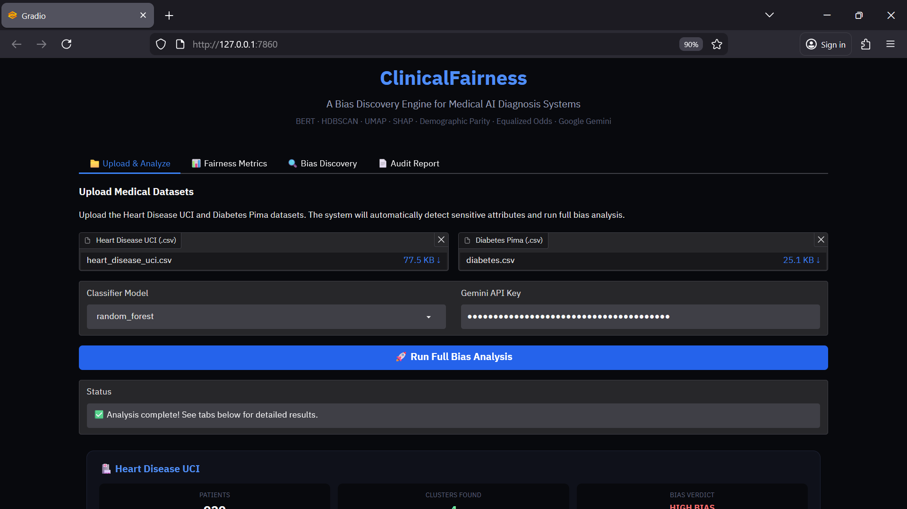
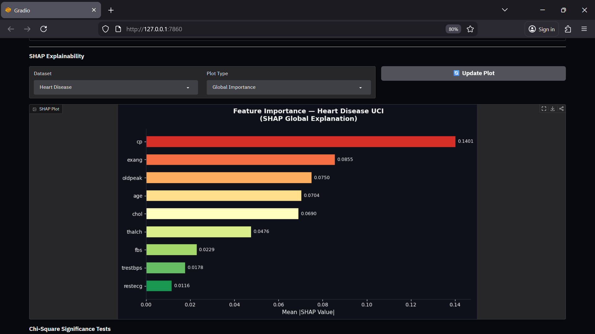
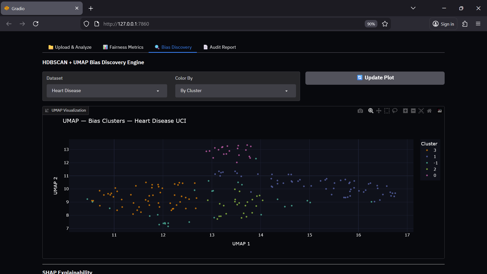
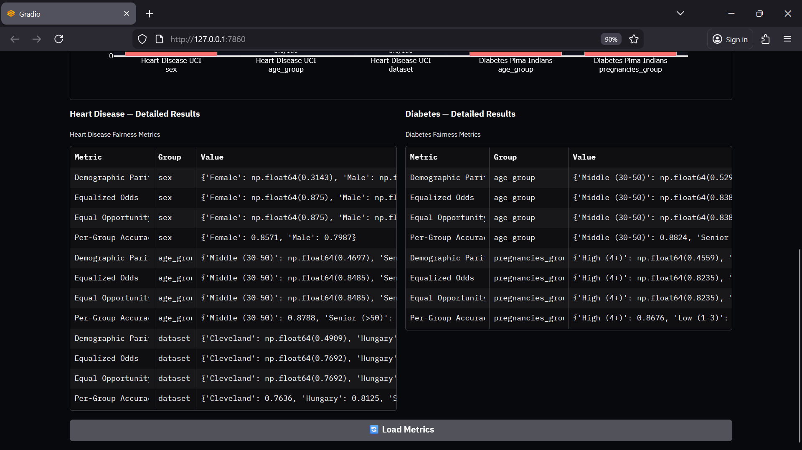
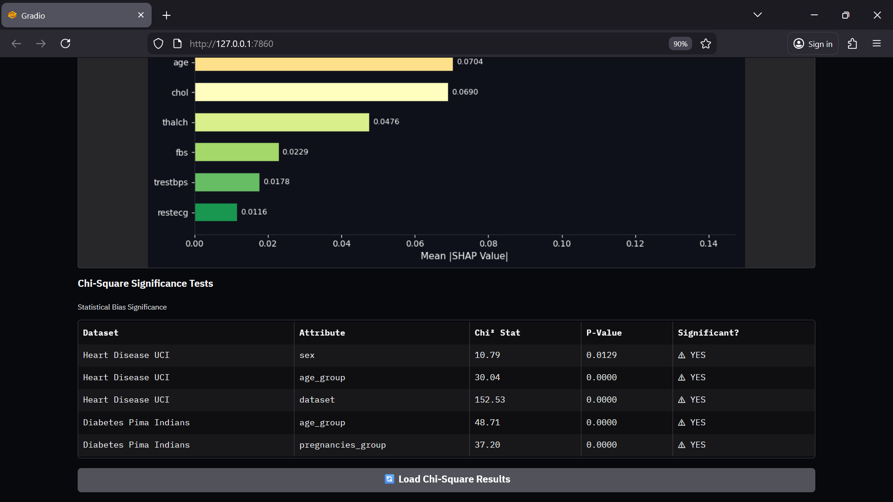
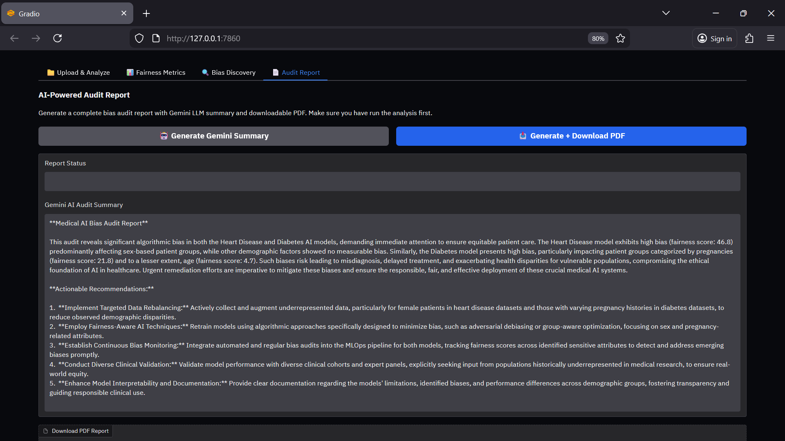

#  ClinicalFairness: A Bias Discovery Engine for Medical AI Diagnosis Systems

---

## Overview

ClinicalFairness is an advanced AI-driven bias detection system designed to evaluate fairness in medical diagnosis models. It identifies disparities across sensitive attributes such as race, gender, and age, ensuring that machine learning systems used in healthcare are equitable and unbiased.

The system combines unsupervised learning (HDBSCAN), dimensionality reduction (UMAP), and fairness metrics such as Demographic Parity and Equalized Odds. It further integrates SHAP explainability and Google Gemini LLM to automatically generate comprehensive audit reports, making it a complete fairness evaluation pipeline for clinical AI systems.


- **Logistic Regression** — primary interpretable classifier
- **Fairlearn** — statistical fairness metrics across sensitive groups
- **SHAP** — feature-level explanation of predictions
- **HDBSCAN** — unsupervised discovery of hidden demographic clusters
- **UMAP** — 2D dimensionality reduction for cluster visualization

---

## Try It Live

👉 [Click Here to View Live Demo](https://huggingface.co/spaces/thesatyajit/ClinicalFairness)

---

## 📊 Data Sources

The project utilizes publicly available clinical datasets for fairness analysis:

* **Diabetes Dataset (Pima Indians Diabetes Dataset)**
  Source: [Kaggle Dataset](https://www.kaggle.com/datasets/uciml/pima-indians-diabetes-database)

* **Heart Disease Dataset (UCI Heart Disease Dataset)**
  Source: [Kaggle Dataset](https://www.kaggle.com/datasets/ronitf/heart-disease-uci)

These datasets are widely used in healthcare machine learning research and provide a reliable foundation for evaluating bias across demographic groups.

---

## Table of Contents

* [Core Features](#core-features)
* [Project Structure](#project-structure)
* [Methodology Deep Dive](#methodology-deep-dive)
* [Technical Stack](#technical-stack)
* [Model Performance](#model-performance)
* [Fairness Audit Results](#fairness-audit-results)
* [Bias Discovery — HDBSCAN + UMAP](#Bias-Discovery-HDBSCAN-UMAP)
* [Installation and Setup](#installation-and-setup)
* [How to Use](#how-to-use)
* [Generated Outputs](#generated-outputs)
* [Contributing](#contributing)
* [License](#license)
* [Acknowledgments](#acknowledgments)

---

## Core Features

* Bias detection across race, gender, and age
* HDBSCAN clustering for subgroup discovery
* UMAP dimensionality reduction and visualization
* Fairness metrics (Demographic Parity, Equalized Odds)
* SHAP-based explainability
* Automated PDF audit reports using Gemini LLM
* Interactive Gradio web application

---

## Project Structure

```
ClinicalFairness/
├── .gitignore                 # Ignore unnecessary files
├── LICENSE                    # License file
├── README.md                  # Project documentation
├── requirements.txt           # Dependencies
├── app.py                     # Gradio web interface
│
├── data/                      # Clinical datasets
│
├── outputs/                   # Generated reports and outputs
│   └── audit_report.pdf       # Gemini-generated audit report
│
├── models/                    # ML models (if applicable)
│
├── fairness/                  # Fairness evaluation module
│   ├── metrics.py             # Fairness metrics (DP, EO)
│   ├── bias_detection.py      # Bias detection logic
│
├── clustering/                # Clustering module
│   ├── hdbscan_model.py       # HDBSCAN implementation
│   ├── umap_reduction.py      # UMAP dimensionality reduction
│
├── explainability/            # Model explainability
│   └── shap_analysis.py       # SHAP visualization
│
├── reporting/                 # Report generation
│   └── gemini_report.py       # Gemini LLM integration
│
└── utils/                     # Utility functions
    └── helpers.py
```


---

## Methodology Deep Dive

The system follows a structured pipeline to detect and analyze bias in clinical AI models:

1. **Data Processing**  
   - Load clinical datasets (Heart Disease, Diabetes)  
   - Clean and preprocess features  
   - Identify and encode sensitive attributes (e.g., age, gender)  

2. **Dimensionality Reduction**  
   - Apply UMAP to reduce high-dimensional feature space  
   - Preserve data structure for better clustering  

3. **Clustering**  
   - Use HDBSCAN to identify hidden subgroups within the data  
   - Detect potential bias clusters without predefined labels  

4. **Fairness Evaluation**  
   - Compute Demographic Parity to assess outcome distribution fairness  
   - Compute Equalized Odds to evaluate prediction consistency across groups  

5. **Explainability**  
   - Use SHAP to analyze feature importance  
   - Identify which features contribute most to biased predictions  

6. **Report Generation**  
   - Generate automated PDF audit reports using Gemini LLM  
   - Summarize bias findings and model behavior in a human-readable format  

---

## Technical Stack

| Component | Technology |
|:---|:---|
| Core ML | scikit-learn, NumPy, pandas |
| Fairness Auditing | Fairlearn |
| Explainability | SHAP |
| Cluster Discovery | HDBSCAN, UMAP-learn |
| Soft Clustering | Gaussian Mixture Models (GMM) |
| Embeddings | Sentence Transformers (SBERT) |
| LLM Report Generation | Google Gemini API |
| Visualization | Plotly, Matplotlib, Seaborn |
| UI | Gradio |
| Report Output | ReportLab (PDF) 
---
## Model Performance

**🫀 Heart Disease UCI Dataset**
*920 patients · 9 clinical features · Binary classification*

| Model | Accuracy | F1 Score | AUC-ROC |
|:---|:---:|:---:|:---:|
| Logistic Regression | 82.6% | 0.838 | 0.885 |
| **Random Forest** | **82.6%** | **0.845** | **0.902** |
| Gradient Boosting | 80.9% | 0.828 | 0.885 |

**🩺 Diabetes Pima Indians Dataset**
*768 patients · 8 clinical features · Binary classification*

| Model | Accuracy | F1 Score | AUC-ROC |
|:---|:---:|:---:|:---:|
| Logistic Regression | 70.8% | 0.571 | 0.826 |
| Random Forest | 86.4% | 0.804 | 0.944 |
| **Gradient Boosting** | **88.3%** | **0.833** | **0.957** ✨ |

---
## Fairness Audit Results

> All fairness metrics were computed using Fairlearn across sensitive demographic attributes.
> **Evaluation Threshold:** Demographic Parity Disparity < 0.10 → Pass


**🫀 Heart Disease — Gender Fairness**

| Group         | Accuracy |  TPR  | Positive Prediction Rate |
| :------------ | :------: | :---: | :----------------------: |
| Female (n=35) |   82.9%  | 0.875 |           34.3%          |
| Male (n=149)  |   82.6%  | 0.809 |           56.4%          |

```
Demographic Parity Disparity : 0.221  →  FAIL
Equalized Odds (TPR gap)      : 0.067  →  PASS
Per-group Accuracy Disparity  : 0.003  →  PASS
Fairness Score                : 54.6 / 100
```

> **Insight:**
> A 22 percentage-point disparity exists in positive prediction rates (56.4% vs 34.3%).
> Despite similar accuracy across groups, the model is more likely to flag male patients, reflecting known clinical underdiagnosis patterns in women.


**Heart Disease — Geographic Origin Bias**

| Origin        | Accuracy |  TPR  |      FPR     |
| :------------ | :------: | :---: | :----------: |
| Cleveland     |   81.8%  | 0.731 |     0.103    |
| Hungary       |   89.1%  | 0.727 |     0.024    |
| Switzerland   |   85.7%  | 0.889 | **1.000 ⚠️** |
| VA Long Beach |   70.3%  | 0.889 | **0.800 ⚠️** |

```
Demographic Parity Disparity : 0.627  →  FAIL
Equalized Odds (TPR gap)     : 0.162  →  FAIL
Fairness Score               : 6.4 / 100
```

> **Insight:**
> Severe institutional bias is observed:

* Switzerland dataset → FPR = 1.0 (all patients predicted positive)
* VA Long Beach → lower accuracy (70.3%)

This indicates dataset heterogeneity, where differences in data collection across institutions are learned by the model.


**🩺 Diabetes — Age Group Fairness**

| Age Group           | Accuracy |      TPR     | Positive Rate |
| :------------------ | :------: | :----------: | :-----------: |
| Young < 30 (n=89)   |   75.3%  | **0.389 ⚠️** |     20.2%     |
| Middle 30–50 (n=51) |   64.7%  |     0.613    |     49.0%     |
| Senior > 50 (n=14)  |   64.3%  |     0.800    |     57.1%     |

```
Demographic Parity Disparity : 0.369  →  FAIL
Equalized Odds (TPR gap)     : 0.411  →  FAIL
Fairness Score               : 0.0 / 100
```

> **Insight:**
> Young patients (<30) have TPR = 38.9%, meaning the model misses ~60% of true cases in this group.

This represents a high-risk clinical issue, as delayed diagnosis can significantly impact long-term outcomes.


**🧠 Key Takeaways**

* Models achieve strong predictive performance
* Significant fairness disparities exist across gender, geography, and age
* Bias is systematic and measurable, not random

> These fairness violations do not indicate model failure, but reveal underlying data and structural biases that must be addressed for safe deployment.


**🎯 Final Insight**

> High accuracy alone is not sufficient in healthcare AI.
> Ensuring fairness and equitable performance across all demographic groups is essential for building trustworthy and ethical machine learning systems.

---

## Bias Discovery — HDBSCAN + UMAP

**Pipeline**

```
Raw Features → StandardScaler → UMAP (2D) → HDBSCAN → GMM (soft) → Chi-Square Test
                                n_neighbors=15          min_cluster_size=10
                                min_dist=0.1
```


---
## Installation and Setup

```bash
git clone https://github.com/your-username/ClinicalFairness.git
cd ClinicalFairness
```

```bash
python -m venv venv
source venv/bin/activate
venv\Scripts\activate
```

```bash
pip install -r requirements.txt
```

---

## How to Use

```bash
python app.py
```

---

## Generated Outputs

### 📊 Bias Analysis Dashboard
<p align="center">
  
</p>

### 📈 SHAP Explainability (Feature Importance)
<p align="center">
  
</p>

### 🔍 Bias Discovery (HDBSCAN + UMAP Clusters)
<p align="center">
  
</p>

### ⚖️ Fairness Metrics Evaluation
<p align="center">
  
</p>

### 📉 Statistical Bias Significance (Chi-Square Test)
<p align="center">
  
</p>

### 📄 AI-Generated Audit Report (Gemini LLM)
<p align="center">
  
</p>

---

## Contributing

1. Fork the repository
2. Create a feature branch
3. Commit changes
4. Submit a Pull Request

---

## License

This project is licensed under the MIT License — see the [LICENSE](LICENSE) file for details.

---

## Acknowledgments

* Developed by Satyajit Deshmukh
* Built using the powerful capabilities of the open-source Python data science ecosystem
* Inspired by research in AI fairness and ethical machine learning
* SHAP for explainability and transparency
* Google Gemini for automated report generation


